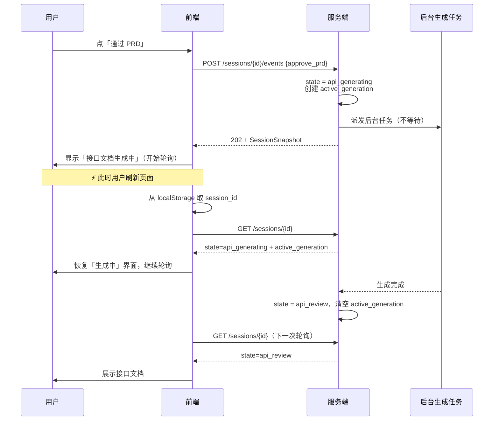

# 会话持久化方案（刷新不丢）

> 版本 v0.2 ｜ 关联：`docs/状态数据设计.md`（服务端数据契约）、`docs/状态机设计.md`（13 状态）
>
> 范围：本文只解决**浏览器刷新 / 关闭重开**这一场景。服务端持久化的字段清单见
> `docs/状态数据设计.md` §5，本文不重复列举，只补充刷新场景特有的部分。
>
> **v0.2 变更**：补上「填表中刷新」这一场景（v0.1 只在数据结构注释里带过，没有独立章节）。
> 三个刷新场景现在并列：§5 填表中 / §6 对话中 / §7 生成中。

---

## 1. 一条前提：权威在服务端，浏览器只存指针

| 数据 | 权威位置 | 浏览器是否缓存 |
| --- | --- | --- |
| 会话状态、对话历史、文档正文 | **服务端** | ❌ 不缓存 |
| 当前会话 id | 服务端（但浏览器要记住"是哪一个"） | ✅ localStorage |
| 未同步的表单修改 | 服务端 | ✅ localStorage（仅降级用，见 §5.2） |
| UI 偏好（折叠状态、上次看的文档） | 无 | ✅ localStorage |

**为什么不把表单和对话也存浏览器**：一旦前端也存一份，就有了两个真相。
刷新后前端可能拿本地数据渲染，而服务端已经有更新的版本（用户在另一个标签页改过），
结果是**本地覆盖服务端，用户以为改丢了**。多标签页下这是必然发生，不是可能发生。

**正确做法**：浏览器只记住「哪个会话」，加载时一律从服务端拉快照。

---

## 2. 存储选型

| 存储 | 容量 | 生命周期 | 跨标签页共享 | 同步 API | 结论 |
| --- | --- | --- | --- | --- | --- |
| **localStorage** | 5–10 MB | 永久，手动清除 | ✅ 共享 | 同步（阻塞主线程） | ✅ **主选** |
| sessionStorage | ~5 MB | **标签页关闭即清** | ❌ 每标签页独立 | 同步 | ❌ **不用** |
| IndexedDB | 数十 MB–GB | 永久 | ✅ 共享 | 异步 | ⏸ 本期不用 |

### 为什么不用 sessionStorage

它满足"刷新不丢"，但**关掉标签页就丢** —— 用户关页面、再打开浏览器就找不回会话，
而这正是 F1.3 会话恢复要解决的场景。另外它**每个标签页独立**，用户在两个标签页打开同一会话时，
两边的本地状态会各自演化，与服务端的分叉得更厉害。

### 为什么暂不用 IndexedDB

本期没有大对象要存：文档正文（可能上万字符）在服务端，按需拉取即可。
等到要做**离线查看 / 离线导出**时再上 IndexedDB。现在引入它只会增加异步复杂度。

### localStorage 的两个注意点

- **同步 API 会阻塞主线程**：只在加载和关键节点读写（几 KB），**不要**用它做高频自动保存。
  表单自动保存走防抖后的服务端接口（§5.1），不写 localStorage。
- **同源共享，无隔离**：同一浏览器上 localhost 的开发环境和线上环境会互相覆盖。
  key 里带环境前缀（§4.2）可以缓解。

---

## 3. 需要持久化的数据

### 3.1 服务端（权威，刷新后从这里恢复）

完整的字段清单见 `docs/状态数据设计.md` §5.1。刷新场景下**最关键的是这五项**：

| 字段 | 没有它会怎样 |
| --- | --- |
| `state` | 刷新后不知道流程走到哪一步，界面无法恢复 |
| `form` | 表单已填内容全部丢失 |
| `dialogue.stage` / `round_index` | 对话要从头开始 |
| `dialogue.messages` | AI 会重复问已答过的问题 |
| `dialogue.active_turn` | 不知道"某一轮正在生成 AI 回复"，刷新后无法恢复该轮（§6） |

### 3.2 浏览器侧（只有这四类）

| # | key | 内容 | 生命周期 |
| --- | --- | --- | --- |
| 1 | `current_session` | 当前会话 id + 保存时间 | 切会话时覆盖；会话删除时清除 |
| 2 | `draft:{id}` | **未同步成功**的表单修改 | 同步成功后立即删除 |
| 3 | `ui` | 高级选项是否展开、上次查看的文档、列表排序 | 长期保留 |
| 4 | `sessions_cache` | 会话列表的只读缓存 | 每次拉列表时覆盖 |

第 4 项是为了**离线打开时列表不空**，可选。前两项是必需的，第 3 项纯体验。

---

## 4. 数据结构

### 4.1 统一信封

浏览器侧所有数据都套同一个信封，便于统一做版本判断：

```json
{
  "schema": 1,
  "env": "local",
  "saved_at": "2025-01-01T10:00:00.000Z",
  "payload": { }
}
```

| 字段 | 说明 |
| --- | --- |
| `schema` | **数据结构的版本号**。读取时与当前代码支持的版本比对（§8） |
| `env` | 环境标识（`local` / `dev` / `prod`），防止开发环境数据污染线上 |
| `saved_at` | 写入时间，用于判断本地数据是否比服务端新（§5.2） |
| `payload` | 各 key 自己的内容 |

### 4.2 localStorage key 命名

```
harnessprd:{env}:{schema}:{kind}[:{session_id}]
```

实例：

```
harnessprd:local:1:current_session
harnessprd:local:1:draft:7f3a2c91
harnessprd:local:1:ui
harnessprd:local:1:sessions_cache
```

**`schema` 放进 key** 是关键设计：主版本升级时直接换命名空间，
旧 key 不会被新代码误读，也不会在读取时反复报错 —— 清理是惰性的（写新 key 时可顺手删旧前缀）。

### 4.3 各 key 的 payload

**current_session**

```json
{
  "session_id": "7f3a2c91",
  "state_at_save": "dialogue",
  "saved_at": "2025-01-01T10:00:00.000Z"
}
```

`state_at_save` 只是**离线提示用的快照**，不是真相。加载时一律以服务端返回的 state 为准 ——
本地记着 `dialogue` 但服务端已经 `completed` 时，以服务端为准。

**draft:{session_id}**（只在同步失败时存在）

```json
{
  "form": { "product_name": "群聊周报助手", "problem": "……" },
  "server_revision": 12,
  "saved_at": "2025-01-01T10:00:03.000Z"
}
```

`server_revision` 记录草稿基于服务端的哪个版本，用于检测冲突。

---

## 5. 「填表中」刷新页面怎么处理

### 5.1 机制：防抖自动保存到服务端

表单填写期间，前端**防抖 800ms** 把变更写到服务端（`PUT /sessions/{id}/form`）。
服务端的 `form_editing` 状态本来就要求写入 `form`（见 `docs/状态数据设计.md` §3），所以这是顺理成章的。

**为什么以服务端为主，而不是存 localStorage**：表单是用户最核心的输入，
本地存储在多标签页、清缓存、换设备的场景下都不可靠。服务端存草稿，换台电脑打开也能接着填。
localStorage 只作为**同步失败时的降级兜底**。

| 方案 | 评价 |
| --- | --- |
| 每次按键都请求服务端 | ❌ 请求量爆炸 |
| **防抖 800ms 写服务端（主）+ localStorage 兜底** | ✅ **采用** |
| 只写 localStorage，提交时才上服务端 | ❌ 清缓存/换设备即丢，且多标签页会分叉 |

### 5.2 三种失败情况

| 情况 | 处理 |
| --- | --- |
| 保存请求失败（离线 / 超时 / 5xx） | 写入 `draft:{id}`，界面显示「修改尚未同步」，并按指数退避重试 |
| 用户在同步完成前刷新 | 加载时发现本地草稿 → 提示「检测到未同步的修改，是否恢复？」 |
| 服务端 `form_updated_at` 比本地草稿旧 | 同上，用 `saved_at` 比较判断谁更新 |

**不要做「本地静默覆盖服务端」** —— 那是丢数据的最短路径。必须让用户确认。

### 5.3 刷新后的恢复流程

```
页面加载
  → 读 current_session 拿 session_id
  → GET /sessions/{id} 拿快照
  → state = form_editing
      → 用服务端的 form 渲染表单
      → 若本地存在 draft 且 saved_at 更新
            → 提示「检测到未同步的修改，是否恢复？」
            → 用户选「恢复」→ 用本地草稿覆盖表单并重新同步
            → 用户选「放弃」→ 删除本地草稿
```

### 5.4 提交时的合并

`submit_form` 时如果本地还有未同步草稿，**不能直接提交服务端版本**（会丢掉最后几秒的输入）。

规则：

1. 键级合并 —— 就是以本地草稿为准，但**服务端有而本地没有的键要保留**
2. 合并后再做 schema 校验（长度 / 选项合法性），校验不通过则回到 `form_editing` 并高亮具体题目
3. 提交成功后**立即删除本地草稿**

表单是扁平的键值结构（`docs/状态数据设计.md` §2.1 的 `form: dict[str, str]`），
所以键级合并足够，不涉及嵌套结构的深合并。

---

## 6. 「对话中」刷新怎么处理

对话轮次比生成快（≤15s，`docs/功能清单.md` §6），但仍然会丢。处理原则：
**用户消息先落库，AI 回复后补。**

```
apply_event(dialogue, "reply", {content})

1. 立刻把用户消息 append 到 dialogue.messages
2. 设置 dialogue.active_turn = { started_at, stage }
3. 调用 LLM 生成该轮回复（后台任务或请求内均可）
4. 成功 → append AI 消息，清空 active_turn
   失败 → 保留用户消息，清空 active_turn，写 last_error（F3.13）
```

**刷新恢复规则**：

| 快照状态 | 前端行为 |
| --- | --- |
| 最后一条是 `user` 且 `active_turn` 为空 | 该轮未完成 → 服务端自动重新生成该轮回复（幂等：不会重复 append 用户消息） |
| `active_turn` 非空 | 该轮进行中 → 显示"AI 正在思考"，轮询 |
| 最后一条是 `ai` | 正常，等用户输入 |

这样做的意义是**用户打的字永远不会丢** —— 哪怕在点击发送的瞬间断网或刷新。

---

## 7. 「生成中」刷新页面怎么处理

### 7.1 前提：生成必须是后台任务，不能绑在 HTTP 请求上

这是整节最关键的一条。现在的 `/prd/draft` 是**同步阻塞**接口（`docs/功能清单.md` §7 已标注），
如果沿用同步模式，用户刷新会 abort 请求，会出现两个问题：

1. **服务端是否继续处理不确定** —— 取决于 ASGI 服务器对客户端断开的处理，不可依赖
2. **结果无人接收** —— 生成完了也没有客户端在监听，用户回来看到的是"没生成"

所以：**`apply_event` 里的 `confirm_generate` / `approve_*` 必须在派发后台任务后立即返回**，
状态先落成 `*_generating`，客户端靠轮询或 SSE 跟进。

### 7.2 时序



### 7.3 前端要做的事

**几乎什么都不用做** —— 这正是"浏览器只存指针"带来的好处：

1. 页面加载 → 读 `current_session` 拿 `session_id`
2. `GET /sessions/{id}` 拿快照
3. 若 `state` 是 `*_generating` → 显示生成中，**继续轮询**
4. 若快照里 `active_generation.document` 存在 → 显示「正在生成：接口文档」

**前端不需要自己记"我发起过生成"** —— 服务端的 `state` 就是真相。
本地记这个东西只会在服务端已经完成时让前端错误地显示"生成中"。

### 7.4 服务端要做的事

| 情况 | 处理 |
| --- | --- |
| 任务仍在运行（同进程） | 正常，快照返回 `active_generation` |
| **任务已消失**（进程重启、发版、任务崩溃） | **孤儿生成态** → 降级为 `generation_failed`，`last_error = "生成任务已中断"`，清空 `active_generation` |

降级而**不是自动重试**：生成有真实成本，不该在用户不知情时重复扣费。
前端拿到 `generation_failed` 后显示「生成已中断」+「重试」按钮。

> 本期内存存储下，进程重启后会话本身就没了，不会出现孤儿态。
> 但**一旦切到 Postgres（F7.2）就必然出现**，实现 `PostgresSessionStore` 时必须同时实现。

### 7.5 轮询间隔建议

| 阶段 | 间隔 |
| --- | --- |
| `*_generating` | 2 秒 |
| 对话等待 AI 回复 | 1 秒 |
| 其他状态 | 不轮询（靠用户操作触发） |

轮询期间若标签页被切到后台，用 `document.visibilityState` 暂停，
回到前台时立刻拉一次 —— 避免用户挂着页面时无谓地打服务端。

---

## 8. 版本兼容策略

### 8.1 三处版本号，各管各的

| 版本号 | 位置 | 管什么 |
| --- | --- | --- |
| `schema` | localStorage key + 信封 | 浏览器侧数据结构 |
| `form_version` | 服务端 `SessionState` | 表单题目定义（`questions_config.json`） |
| `prompt_version` | 服务端 `SessionState` | 提示词模板 |

三者独立演进，**不要合并** —— 改个提示词不该影响浏览器缓存的处理。

### 8.2 浏览器侧的版本处理（可以粗暴）

**关键区别：浏览器侧数据不是权威的，所以不兼容时直接丢弃即可，不需要迁移。**

| 情况 | 处理 |
| --- | --- |
| key 里的 `schema` 与当前不符 | 直接读不到 → 视同没有本地数据，正常从服务端加载 |
| 信封里的 `schema` **大于**当前支持 | 忽略并清除该 key（新版本前端写的，旧代码读不懂） |
| 信封里的 `schema` **小于**当前支持 | 尝试简单迁移；迁移逻辑超过十几行就**直接丢弃** |
| `env` 与当前环境不符 | 忽略，不读 |
| `saved_at` 超过 7 天 | 清除（陈旧缓存无价值） |

**不要为浏览器缓存写复杂的迁移链** —— 它只是加速和降级，丢了最坏结果是多打一次接口。

### 8.3 服务端的版本处理（必须严谨）

服务端不能丢数据，所以策略完全不同，规则见 `docs/状态数据设计.md` §6.2：

- 一律按会话自己的 `form_version` 解释 `form`，不按当前配置
- 新增题 = minor 版本；**删除题或改 `id` = major 版本**
- 主版本不兼容时提示用户「表单已更新，建议重新填写」，但不强制

---

## 9. 多标签页并发

同一会话在两个标签页打开是常见情况（用户对照着看）。因为权威在服务端，
**数据不会分叉**，但会出现「A 标签页的操作在 B 标签页不显示」。

处理：

1. `SessionSnapshot` 带 `revision`（服务端每次写入 +1）
2. 前端轮询时比对 `revision`，变化了就整体重渲染
3. 写操作（`apply_event`）带 `expected_revision`，**不符时返回 409**
4. 前端收到 409 → 提示「该会话已在其他标签页被修改」+ 刷新按钮

**不要做自动合并** —— 两个标签页同时改同一个表单，合并结果几乎不可能符合用户预期。
409 + 手动刷新更简单也更不丢数据。

另外监听 `storage` 事件：A 标签页切换了当前会话时，B 标签页能立刻感知
（仅影响"当前会话"这个指针，不影响权威数据）。

---

## 10. 待确认

| # | 问题 | 影响 |
| --- | --- | --- |
| P1 | 是否接受「生成改为后台任务 + 前端轮询」？ | 这是 §7 的全部前提；沿用同步阻塞接口则生成中刷新无解 |
| P2 | 进度用**轮询**还是 **SSE**？ | 轮询简单；SSE 更实时，但要处理断线重连与代理兼容 |
| P3 | 表单自动保存的防抖间隔取 800ms 是否合适？ | 影响请求量与"改丢"的窗口 |
| P4 | 多标签页冲突是 409 报错（本文方案）还是自动合并？ | 报错安全，合并体验好但复杂且易错 |
| P5 | `sessions_cache` 这个可选项要不要做？ | 只为离线时列表不空 |
| P6 | 本地草稿的 7 天过期是否合适？ | 影响本地存储的占用 |
