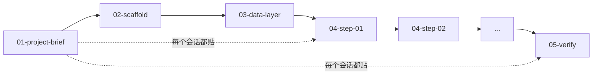

# AI 提示词套件模板

> 版本 v0.1 ｜ 目标读者：**AI 编程工具**（Cursor / Claude Code / Codex 等），由开发者粘贴执行
> 关联：`docs/PRD模板.md`、`docs/接口文档模板.md`、`docs/功能清单.md` §5.3、`backend/core/questions_config.json`

---

## 0. 三条设计约束

**① 输入只有 PRD + 接口文档 + 表单，每类必须有来源。**
和另外两份产物一样是自动生成的。没有输入来源的内容只会写成泛泛的建议
（"请实现用户模块"），而泛泛的提示词 AI 会跳过或自由发挥。

**② 提示词是给 AI 读的，不是给人读的。**
判断标准只有一条：**AI 拿到这段文字，能不能不追问、不猜、直接动手？**
所以要求必须可判定 —— "代码要优雅" 是无效约束，"禁止引入 ORM，统一用
`asyncpg` 裸 SQL" 才是有效约束。

**③ 格式随目标工具与项目类型分支。**
`Q5`（是否指定目标工具）与表单的 `existing_system`（新建 / 改造）会显著改变形态，
见 §5。

---

## 1. 五类提示词

| # | 类别 | 标识 | 用途 | 使用时机 | 文件 |
| --- | --- | --- | --- | --- | --- |
| 1 | **总控提示词** | `PROJECT-BRIEF` | 建立全局上下文与不可协商的约束 | **每个新会话开头必贴** | 1 个 |
| 2 | **脚手架提示词** | `SCAFFOLD` | 把空目录变成能跑起来的骨架 | 一次性 | 1 个 |
| 3 | **数据层提示词** | `DATA-LAYER` | 把数据模型落成表 / 实体 / 迁移 | 一次性 | 1 个 |
| 4 | **功能实现提示词** | `FEATURE` | 按依赖顺序逐步实现功能（**主体**） | 逐步 | **N 个** |
| 5 | **验收自检提示词** | `VERIFY` | 对照验收标准自检并补测试 | 最后 | 1 个 |

### 套件目录结构

```
prompt-suite/
├── 00-README.md              套件说明、使用顺序、依赖关系图（不是提示词本身）
├── 01-project-brief.md       类别 1
├── 02-scaffold.md            类别 2
├── 03-data-layer.md          类别 3
├── 04-step-01-<模块名>.md     类别 4（N 个）
├── 04-step-02-<模块名>.md
├── ...
└── 05-verify.md              类别 5
```

> `00-README.md` **不属于五类提示词**，它是给人看的导航页。
> 不要把它贴给 AI —— 它对模型没有信息量，只占上下文。

### 为什么按这个维度切分

切分依据是**"什么时候需要它"**，不是"它对应哪份输入文档"。

| 被否掉的切法 | 问题 |
| --- | --- |
| 后端 / 前端 分开 | AI 会写出前后端字段不一致的代码；同一个模块的接口与界面必须在同一步里定 |
| 按 PRD 章节一一对应 | PRD 第 4 章功能需求会拆成 8 个文件，而第 11 章非功能需求无处可放 |
| 只有「总控 + 分步」两类（§5.3 当前写法） | 脚手架与数据层没有归属，会被塞进 step-01，导致第一步过重且失败后要全部重来 |

---

## 2. 各类提示词：内容要点与格式要求

### 类别 1：总控提示词 `PROJECT-BRIEF`

**用途**：一次性建立全局上下文与不可协商的约束。等价于项目的 `.cursorrules` / `CLAUDE.md`。

**内容要点**

| # | 要点 | 来源 |
| --- | --- | --- |
| 1 | 项目一句话定位 | PRD 第 2 章 |
| 2 | 技术栈与版本 | 表单 `tech_stack` |
| 3 | 目录结构约定 | 表单 `engineering_conventions` |
| 4 | 代码规范：命名、格式化、lint、分支与提交 | 表单 `engineering_conventions` |
| 5 | **数据约定**：时间 ISO 8601 UTC、金额整数分、JSON 字段 `snake_case` | 接口文档第 2 章 |
| 6 | **错误处理约定**：错误码格式、统一错误体 | 接口文档第 4 章 |
| 7 | **硬性禁止事项** | 表单 `engineering_conventions` + 推导 |
| 8 | **视觉与交互约定** | 表单 `style_preference` —— **该字段在三份产物里的唯一落点** |
| 9 | **安全与合规约定** | 表单 `compliance`（如「手机号加密存储」「需审计日志」「数据不外发」） |
| 10 | 术语表 | PRD 附录 A |

**格式要求**

- **≤ 1000 字**。它要被贴进每一个会话，太长会挤占上下文预算
- Markdown，用 `#` 分节；禁止用 HTML
- **只写"是什么 / 必须怎样"，不写"要做什么功能"** —— 功能属于类别 4
- **每条约束必须可判定**：

  | ✅ 可判定 | ❌ 不可判定 |
  | --- | --- |
  | 禁止引入 ORM，统一用 `asyncpg` 裸 SQL | 数据库访问要优雅 |
  | 所有接口入参必须用 Pydantic 校验 | 注意参数安全 |

- **不与 PRD / 接口文档重复**：那两份是"需求"，这份是"约束"。重复会让两处描述漂移

**示例骨架**

```markdown
# 项目约定：<产品名>

## 技术栈
后端 Python 3.12 + FastAPI；数据库 PostgreSQL 16；前端 React 18 + Vite。
版本以 `05-verify.md` 列出的清单为准，不要自行升级。

## 目录结构
- 后端业务逻辑放 `services/`，路由放 `api/`，配置放 `core/`
- 分层依赖单向：`api → services → core`，禁止反向 import

## 数据约定
- 时间一律 ISO 8601 UTC，字段名以 `_at` 结尾
- 金额用整数分（int），字段名以 `_cents` 结尾
- JSON 字段 snake_case

## 错误处理
- 错误体统一为 `{code, message, details, trace_id}`
- 错误码格式 `{模块缩写}{3位序号}`，如 `RPT001`

## 禁止事项
- 禁止引入 ORM / 重量级框架
- 禁止在路由层写业务逻辑
- 禁止把 UI 文案硬编码在服务端
```

---

### 类别 2：脚手架提示词 `SCAFFOLD`

**用途**：把空目录变成能跑起来的骨架。**一次性**执行。

**内容要点**

| # | 要点 | 说明 |
| --- | --- | --- |
| 1 | 目标目录结构 | 完整树，不是"大致如下" |
| 2 | 依赖清单 | 表格：包名 / 版本约束 / 用途 |
| 3 | 配置文件清单 | `.env.example`、lint 配置、Dockerfile、CI |
| 4 | 启动与验证方式 | 跑什么命令、看到什么输出算成功 |
| 5 | **暂不实现的部分** | 明确列出，防止 AI 顺手把业务逻辑写了 |

**格式要求**

- Markdown + 代码块，代码块标注语言
- **必须含"完成判据"**：具体命令 + 预期输出。没有判据的脚手架提示词，AI 会停在"看起来建好了"
- 依赖清单**禁止开放式表述**：❌「选择合适的数据库驱动」✅ 表格列出 `asyncpg==0.29.*`
- **必须显式列出"本步不做"** —— 这是防止 AI 越界的关键
- **必须含「部署与上线」小节**（环境变量清单、迁移执行顺序、回滚方式），来源是 `hard_constraints` 的部署环境部分
- **≤ 1500 字**

---

### 类别 3：数据层提示词 `DATA-LAYER`

**用途**：把接口文档「数据模型」落成可运行的表 / 实体 / 迁移。**一次性**执行。

**内容要点**

| # | 要点 | 来源 |
| --- | --- | --- |
| 1 | 实体清单与字段表（类型 / 必填 / 唯一 / 默认 / 索引） | 接口文档第 4 章 |
| 2 | 实体关系（一对多 / 多对多）与外键策略 | 接口文档第 4 章 |
| 3 | 枚举值全集 | 接口文档附 A |
| 4 | **级联规则**：删 A 时关联的 B 怎么办 | PRD 第 7 章边界条件 |
| 5 | 迁移策略与种子数据 | 推导 |

**格式要求**

- **字段表用 Markdown 表格，一行一字段**，不要写成叙述
- **字段名原文引用接口文档，禁止重命名**（F8.5 命名一致性校验依赖这一点）
- 必须声明时间与金额的**存储形态**（`timestamptz` / `bigint` 分）
- 每个实体给出**目标形态**：要么给建表 SQL，要么明确写"按上表生成，命名用 snake_case"
- **≤ 1500 字**（不含表格）

---

### 类别 4：功能实现提示词 `FEATURE`（**主体**）

**用途**：按依赖顺序逐步实现功能。每步一个文件，可整段复制执行。

**内容要点**

每步必须包含以下 7 项，顺序固定：

| # | 项 | 要求 |
| --- | --- | --- |
| 1 | 任务目标 | 一句话，可判定"做完了没有" |
| 2 | **前置上下文** | 依赖哪些已完成步骤，**并写出它们的产物**（文件名、表名、接口路径） |
| 3 | 涉及的文件 | 新建/修改，给完整路径 |
| 4 | 涉及的接口 | 引用接口文档的方法与路径 |
| 5 | 技术约束 | 只写**本步特有**的约束；通用约束引用总控，不重复 |
| 6 | **验收点** | 可执行的验证方式（命令 / 请求 + 预期结果） |
| 7 | **本步不做** | 明确划出边界，防止越界实现后续步骤 |

**格式要求**

- 每步一个独立文件，命名 `04-step-NN-<模块名>.md`
- **固定小节顺序**：目标 / 前置 / 涉及文件 / 涉及接口 / 约束 / 验收 / 不做。
  顺序固定是为了让 AI 形成稳定预期，也便于自动校验
- **可整段复制粘贴执行**，不依赖与人的追问
- **步骤间无循环依赖**（F8.4 校验项）
- **不重复粘贴整份 PRD**，按需摘要引用 —— 否则每步都背上 7000 字上下文
- 每步 **≤ 1200 字**
- 步骤粒度：**一步 = 一个可独立验收的模块**；建议 **5–12 步**，P0 功能必须各占至少一步
- 语言用祈使句（"实现 X"、"为 Y 添加校验"），不用"我们可以考虑……"

**示例骨架**

```markdown
# step-03：周报生成接口

## 目标
实现 `POST /api/v1/weekly-reports`，按群聊与时间范围生成周报草稿。

## 前置
- step-02 已完成：`weekly_reports` 表（字段见 `03-data-layer.md`）
- step-01 已完成：项目骨架与 `db` 连接池，位于 `core/db.py`

## 涉及文件
- 新建 `api/reports.py`
- 新建 `services/report_service.py`
- 修改 `api/router.py`（挂载路由）

## 涉及接口
`POST /api/v1/weekly-reports`（见 `接口文档.md` 第 7 章）

## 约束
- 入参用 Pydantic 校验，时间跨度 > 31 天返回 422 + `RPT001`
- 上游群聊服务不可用时返回 502 + `EXT001`，不要重试

## 验收
```bash
curl -X POST localhost:8000/api/v1/weekly-reports \
  -H 'Content-Type: application/json' -d @fixtures/report.json
```
预期：201，响应含 `id` / `status: "draft"` / `groups[]`

## 本步不做
- 不做前端页面（step-05）
- 不做导出功能（step-07）
```

---

### 类别 5：验收自检提示词 `VERIFY`

**用途**：让 AI 对照 PRD 验收标准自检实现，并补齐测试。**最后执行一次**。

**内容要点**

| # | 要点 | 来源 |
| --- | --- | --- |
| 1 | 逐条列出全部 `AC-xx`（Given / When / Then 原文） | PRD 第 13 章 |
| 2 | 每条的验证方式（手动步骤 或 测试用例） | 推导 |
| 3 | 要求的自检报告格式 | 固定 |
| 4 | 补充的测试用例清单（单元 / 集成） | 推导 |
| 5 | **不通过时的处理方式** | 见下 |

**格式要求**

- 验收标准**用表格逐条列出，不省略、不改写**。改写会导致验收口径漂移
- **必须规定输出格式**：

  | AC 编号 | 结论 | 证据 | 问题 |
  | --- | --- | --- | --- |

  结论只能是 **通过 / 不通过 / 无法验证**，不允许"基本满足"
- **必须写明：发现不通过时不要自行修改代码，先列问题清单**。
  否则 AI 会为了"通过验收"而悄悄放宽实现或改测试
- 明确禁止 AI 修改验收标准本身
- **≤ 1500 字**

---

## 3. 格式要求（五类共通）

| 项 | 要求 |
| --- | --- |
| 格式 | 纯 Markdown，**禁止 HTML**（AI 工具对 HTML 的解析不一致） |
| 代码块 | 必须标注语言（```bash / ```python / ```sql） |
| 文件路径 | 用反引号包裹，且是**完整相对路径**（`services/report_service.py`，不是 `report_service.py`） |
| 术语 | 与 PRD 附录 A 的术语表**完全一致**，不自造同义词 |
| 命名 | 实体名、字段名、接口路径与接口文档**逐字一致**（F8.5 校验） |
| 禁止模糊表述 | ❌「等等」「类似的方式」「根据实际情况」—— AI 会把这类词当作"可跳过" |
| 每条要求可判定 | 能被一条命令或一次观察验证 |
| 不重复内容 | 通用约束只写在类别 1；每步只写本步特有的 |

---

## 4. 套件级要求

### 4.1 使用顺序与依赖



- 类别 1 **不是一次性的** —— 每个新会话开头都要贴
- 类别 2 / 3 一次性，产物是类别 4 的前置
- 类别 4 按编号顺序执行，**不可跳步**（前置依赖会断）
- 类别 5 在执行完类别 4 后跑

### 4.2 步骤覆盖矩阵（F8.4 校验依据）

`00-README.md` 必须含一张矩阵表，证明**每个 P0 功能都至少被一步覆盖**：

| PRD 功能需求 | 优先级 | 覆盖步骤 |
| --- | --- | --- |
| FR-01 汇总群聊消息 | P0 | step-02、step-03 |
| FR-02 生成周报草稿 | P0 | step-03 |
| FR-05 周报模板自定义 | P1 | step-06 |

未被任何步骤覆盖的 P0 功能 = 实现漏项，F8.4 会直接判失败。

### 4.3 token 预算

| 类别 | 单份字数 | 份数 | 小计 |
| --- | --- | --- | --- |
| 1 总控 | 500–1000 | 1 | 500–1000 |
| 2 脚手架 | 800–1500 | 1 | 800–1500 |
| 3 数据层 | 800–1500 | 1 | 800–1500 |
| 4 功能实现 | 600–1200 | 5–12 | 3000–14400 |
| 5 验收自检 | 600–1500 | 1 | 600–1500 |
| **合计** | | | **5700–19900** |

- **5 步时**：5700–11500 字
- **8 步时**：7500–15100 字
- **12 步时**：9900–19900 字

三份产物加起来，上限接近 **37500 字**（PRD 7300 + 接口文档 10300 + 套件 19900）。
单次 LLM 调用绝无可能完成，**必须分文件生成** —— 这比 PRD 模板 §4.3 的结论更硬：
套件的每一类、甚至每一个 step 都应该是**独立的生成调用**，这样失败只需重跑一份。

---

## 5. 分支规则

### 5.1 按目标工具（Q5）

`Q5`（提示词套件是否需指定目标工具）尚未定。形态差异：

| 目标工具 | 类别 1 的文件名与形态 | 类别 4 的引用方式 |
| --- | --- | --- |
| Cursor | `.cursorrules`（单文件，无 Markdown 标题也行） | `@文件` 引用 |
| Claude Code | `CLAUDE.md`（Markdown，支持 `@path` 导入） | `@path/to/file` |
| Codex / 通用 | `PROJECT.md`（纯 Markdown） | 直接写路径 |
| 未指定（默认） | `01-project-brief.md`，纯 Markdown、不依赖任何工具的专有语法 | 直接写路径 |

**未指定时一律按"通用"形态生成** —— 不使用任何工具专有语法，保证可移植。

### 5.2 按项目类型（`existing_system`）

| 取值 | 对套件的影响 |
| --- | --- |
| 全新项目 | 按默认流程（脚手架 → 数据层 → 功能 → 验收） |
| 已有系统，要改造 | **类别 2 改为"现状梳理"**：先让 AI 读懂现有结构并输出报告，不建新骨架；**类别 4 每步必须加"不要动哪些文件"** |
| 保留旧系统另建新的并对接 | 类别 3 增加"对接旧库/旧接口"的映射表；类别 4 增加一个对接步骤 |
| 需要迁移历史数据 | 类别 3 增加"迁移脚本"子节，且必须含**数据校验方式**（迁移后怎么确认没丢） |

**改造型项目最容易出事的地方**：AI 不知道哪些文件是"已有的、不要动"的，
会大范围重写。所以**"本步不做"和"不要动"两节在改造型项目里是必填的**。

---

## 6. 质量校验点（对接功能清单 M8）

| 校验 | 对应功能点 | 检查什么 |
| --- | --- | --- |
| 套件完整性 | **F8.4** | 步骤覆盖 PRD 全部 P0 功能（§4.2 矩阵） |
| 命名一致性 | F8.5 | 实体名、字段名、接口路径与 PRD / 接口文档逐字一致 |
| 依赖无环 | — | 步骤构成有向无环图，无循环前置 |
| 结构合规 | — | 类别 4 每步含全部 7 项且顺序正确 |
| 无模糊表述 | — | 不出现「等等」「类似」「视情况」 |
| 预算合规 | — | 各类字数不超上限（§4.3） |

---

## 7. 与既有文档的差异（需要同步）

`docs/功能清单.md` §5.3 目前描述的是**两类**（总控提示词 + step-01…step-N），
本模板扩展为**五类**。差异：

| §5.3 现状 | 本模板 | 说明 |
| --- | --- | --- |
| 总控提示词 | 类别 1 | 一致，补充了「≤800 字」与「只写约束不写功能」 |
| step-01 … step-N | 类别 4 | 一致，7 项内容里有 4 项来自 §5.3（目标 / 前置 / 涉及文件与接口 / 技术约束 / 验收点 / 禁止事项） |
| — | **类别 2 脚手架** | 新增 |
| — | **类别 3 数据层** | 新增 |
| — | **类别 5 验收自检** | 新增 |
| 每步含「禁止事项」 | 拆分 | §5.3 的「禁止事项」拆成 **技术约束**（本步特有） + **本步不做**（边界），两者作用不同 |

**必须同步修改的地方**

| # | 位置 | 改什么 |
| --- | --- | --- |
| 1 | `docs/功能清单.md` §5.3 | 两类 → 五类；补充套件目录结构与使用顺序 |
| 2 | `docs/功能清单.md` F8.4 | 校验对象从「步骤是否覆盖 P0」扩展为「五类齐备 + 覆盖矩阵 + 依赖无环」 |
| 3 | `backend/core/config.py` | 套件上限 19400 字，**远超 `llm_max_tokens = 4096`**；必须按文件独立生成 |

---

## 8. 待确认

| # | 问题 | 影响 |
| --- | --- | --- |
| T1 | 是否接受「两类 → 五类」的扩展？ | 决定 §5.3 是否重写 |
| T2 | 类别 2（脚手架）与类别 3（数据层）是否应合并？ | 合并后第一步过重、失败要全部重来；分开则文件更多 |
| T3 | 步骤粒度按**模块**还是按 **PRD 的 P0 功能**切分？ | 当前是"一步一个可独立验收的模块"，一个模块可能覆盖多条功能需求 |
| T4 | `Q5` 若不指定目标工具，通用形态是否够用？ | 当前默认不用任何工具专有语法 |
| T5 | 改造型项目（`existing_system`）是否要在类别 2 增加"现状梳理"？ | 见 §5.2，改造型最容易出事的点 |
| T6 | 是否需要类别 6「联调与部署」？ | 若 `hard_constraints` 里部署环境要求多，可能需要独立成类 |
| T7 | 每步的「验收点」用**命令**还是**测试用例**？ | 命令直观但依赖环境；测试用例可回归但生成成本高 |
