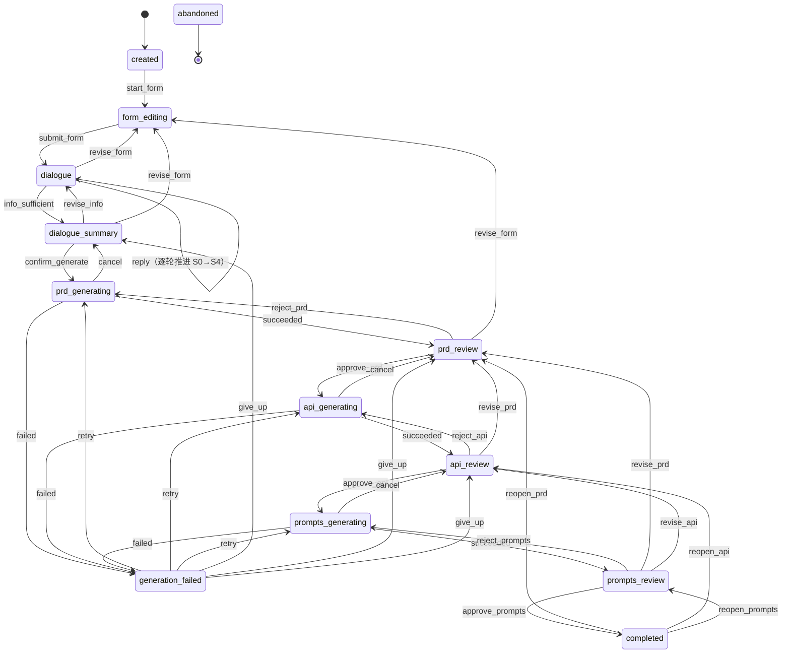

# AI 需求收集工具状态机设计

> 版本 v0.1 ｜ 关联：`docs/功能清单.md`（M1 / M2 / M3 / M4 / M5）、`docs/对话阶段设计.md`
>
> 产品流程：填写表单 → AI 对话 → 生成 PRD → 审核 PRD → 生成接口文档 → 审核接口文档
> → 生成提示词套件 → 审核提示词套件 → 完成

---

## 0. 与既有设计的差异（重要）

`docs/对话阶段设计.md` §3 与 `docs/功能清单.md` §3 的主流程写的是
「**串行生成三份文档 → 统一查看**」，即生成是一次性动作，审核发生在全部产出之后。

本文按你给的流程改为**生成 / 审核交错的串行**：每份文档生成后必须过审核关卡，才能生成下一份。

**这不只是流程图的差别，它改变了三件事：**

| 变化 | 影响 |
| --- | --- |
| 下游文档以「上游已通过审核」为前置 | 编排器不再是「跑三遍」，而是**受状态机驱动的单步推进** |
| 新增「审核」这一动作 | 功能清单里**没有对应的功能点** —— 打回、通过、带反馈重生成都没有归属（F4.6 只管失败重试，F4.8 只管局部改写） |
| 回退必须逐级 | 上游一改，下游全部作废。需要 `stale` 机制（F4.9 已提，但当时没有交错流程，语义不同） |

---

## 1. 状态清单（13 个）

图例：**阶段** = 属于主流程哪一段 ｜ **终态** = 无出边

| # | 状态 ID | 名称 | 含义 | 阶段 |
| --- | --- | --- | --- | --- |
| 1 | `created` | 已创建 | 会话已建，表单未开始填 | 输入 |
| 2 | `form_editing` | 填写表单 | 正在填写或修改 20 题表单 | 输入 |
| 3 | `dialogue` | 对话澄清 | AI 对话进行中，处于 S0–S4 任一阶段 | 输入 |
| 4 | `dialogue_summary` | 摘要确认 | 处于 S5，已汇总信息，等用户确认后触发生成 | 输入 |
| 5 | `prd_generating` | PRD 生成中 | 正在生成 PRD，尚未产出 | 产出 |
| 6 | `prd_review` | PRD 待审核 | PRD 已生成，等用户通过 / 打回 / 编辑 | 产出 |
| 7 | `api_generating` | 接口文档生成中 | 生成中 | 产出 |
| 8 | `api_review` | 接口文档待审核 | 等审核 | 产出 |
| 9 | `prompts_generating` | 提示词套件生成中 | 生成中 | 产出 |
| 10 | `prompts_review` | 提示词套件待审核 | 等审核 | 产出 |
| 11 | `completed` | 已完成 | 三份文档全部通过审核 | 产出（准终态） |
| 12 | `generation_failed` | 生成失败 | 某份文档生成失败，可重试或放弃 | 异常 |
| 13 | `abandoned` | 已废弃 | 用户主动放弃会话 | 异常（**终态**） |

### 三个不单独设状态的判断

**① 表单提交后不设「已提交」状态。**
「填写表单 → 进入对话」之间确实有个边界，但**没有任何用户动作只在此处可用**：
回改表单在对话阶段依然开放（F2.5），而「确认方向」这件事已由 S0 开场复盘承担。
多设一个状态只会让它和 `form_editing` 的操作集几乎重合。表单提交是一个**事件**，不是状态。

**② 生成「取消」不设状态。**
取消是瞬时动作，结果是回到上一个审核点，不需要中间态。

**③ `abandoned` 与 F1.4「删除会话」不是一回事。**

| | `abandoned` | 删除会话（F1.4） |
| --- | --- | --- |
| 性质 | **状态机内的终态** | **数据操作**（`store.delete()`） |
| 会话是否还在 | 在。可出现在列表里，等待 `reap` 回收（F7.5） | 不在 |
| 是否进转换表 | 是（12 条通配入边） | **否**，不进状态机 |

两者都要有：`abandoned` 让用户表达"这个需求不做了"但仍可回看；
删除是"彻底不要了"。不要用 `abandoned` 实现删除。

### 文档级状态（与会话状态正交）

`stale`（过期）**不是会话状态**，而是挂在文档上的标记。原因：同一时刻只有一份文档在审核，
但可能有多份文档同时是过期的。用「会话状态 + 文档标记」组合表达，避免状态爆炸
（否则每加一份文档就多一批状态）。

| 文档级状态 | 含义 |
| --- | --- |
| `not_started` | 尚未生成 |
| `generating` | 生成中 |
| `pending_review` | 待审核 |
| `approved` | 已通过审核 |
| `stale` | **上游已变更，内容可能过期**（对应 F4.9） |
| `failed` | 生成失败 |

**会话状态与文档状态的推导关系**：会话状态 = 第一份未 `approved` 的文档所处的阶段；
三份全部 `approved` 时才是 `completed`。因此 `stale` 一出现，会话就不能停留在 `completed`。

---

## 2. 每个状态用户能做什么

| 状态 | 用户可做的操作 | 明确不可做 |
| --- | --- | --- |
| `created` | ① 开始填表单 ② 放弃会话 | 直接进入对话 |
| `form_editing` | ① 填写 / 修改任意题目 ② 保存草稿 ③ **提交表单**（校验 7 道必填） ④ 放弃会话 | 进入对话（必填未齐时） |
| `dialogue` | ① 回答 AI 的问题 ② 采纳 AI 的建议答案 ③ 跳过某题（标 `[待确认]`） ④ 回改已回答内容（F3.15） ⑤ **回改表单**（F2.5） ⑥ 要求「够了，直接生成」 ⑦ 放弃会话 | 直接生成文档（须先过 S5） |
| `dialogue_summary` | ① **确认并开始生成**（F3.10） ② 要求回到某个阶段补充 ③ 回改表单 ④ 放弃会话 | 单独生成某一份文档（必须从 PRD 开始） |
| `prd_generating` | ① 等待 ② **取消生成**（F4.10） | 编辑、审核、开始生成接口文档 |
| `prd_review` | ① 查看 / 复制 / 下载 PRD ② **通过** → 自动开始生成接口文档 ③ **打回**（可附反馈）→ 重新生成 PRD（F4.8） ④ 手工编辑 PRD ⑤ 回改表单 ⑥ 要求重新生成 ⑦ 放弃会话 | 跳过审核直接生成接口文档 |
| `api_generating` | ① 等待 ② 取消 → 回到 `prd_review` | 编辑、审核 |
| `api_review` | ① 查看 / 复制 / 下载接口文档 ② **通过** → 自动开始生成提示词套件 ③ 打回重生成 ④ 手工编辑 ⑤ **回改 PRD**（接口文档与提示词套件标 `stale`） ⑥ 放弃会话 | 直接回改表单（必须逐级退到 PRD） |
| `prompts_generating` | ① 等待 ② 取消 → 回到 `api_review` | 编辑、审核 |
| `prompts_review` | ① 查看 / 复制 / 下载提示词套件 ② **通过** → `completed` ③ 打回重生成 ④ 手工编辑 ⑤ 回改 PRD / 接口文档 ⑥ 放弃会话 | — |
| `completed` | ① 查看 / 导出三份文档 ② **重新打开任一份审核**（下游标 `stale`） ③ 放弃会话 | 直接修改已通过的内容（须先重开审核） |
| `generation_failed` | ① **重试**（F4.6） ② 放弃本次生成 → 回到上一个审核点 ③ 放弃会话 | 重试时跳过失败的文档 |
| `abandoned` | — | 一切操作（终态） |

### 三处需要你确认的产品判断

1. **通过后自动开始生成下一份**（`approve` → 直接进 `*_generating`），而不是让用户再点一次「生成接口文档」。
   理由：流程里审核与生成是紧邻的，多一次点击没有信息量。若你希望中间能停下来检查，就要改成两步。
2. **回退必须逐级**。在 `api_review` 不能直接回改表单，必须先退到 `prd_review`。
   理由：表单影响 PRD，PRD 影响接口文档 —— 跳级会让中间那份文档的来源无法追溯。
3. **`completed` 不是硬终态**，可以重新打开某份文档的审核。理由：文档交付后改需求是常态，
   硬终态会逼用户新建会话，丢掉全部上下文。

---

## 3. 转换规则

### 3.1 状态图



> 图中省略了两类边以保持可读：**多数自环**（只保留了 `dialogue` 的问答自环；`form_editing`、
> `prd_review`、`api_review`、`prompts_review` 的自环见转换表）与**终止边**
> （除 `abandoned` 外所有状态均可 `abandon` → `abandoned`）。
> 完整的转换表见 §3.2。

### 3.2 完整转换表（触发条件 + 回退方式）

**输入阶段**

| 从 | 事件 | 到 | 触发条件 | 回退方式与代价 |
| --- | --- | --- | --- | --- |
| `created` | `start_form` | `form_editing` | 用户点击「开始填写」 | ❌ **不可回退**（无 `form_editing → created`） |
| `form_editing` | `save_draft` | `form_editing` | 无条件（自动保存，或用户手动保存） | — 自环 |
| `form_editing` | `submit_form` | `dialogue` | ① 7 道必填题均已填写；② 全部字段通过 `form_submission.schema.json` 校验（长度未超限、选择题值在选项内、无多余 key）；③ 提交后 S0 首次 LLM 调用成功 | 在 `dialogue` 上执行 `revise_form`；代价：需重新校验已知信息的冲突项 |
| `dialogue` | `reply` | `dialogue` | 用户提交本轮回答，**且 LLM 调用成功**（超时 / 502 则停在原状态并提示，F3.13） | — 自环 |
| `dialogue` | `info_sufficient` | `dialogue_summary` | 满足任一：① S4 返回 `stage_status = done`；② 用户主动说「够了，直接生成」；③ `round_index` 达到 `max_rounds`（强制收敛，F3.5） | `revise_info`，无损 |
| `dialogue` | `revise_form` | `form_editing` | 用户点击「修改表单」 | `submit_form`，无损 |
| `dialogue_summary` | `revise_info` | `dialogue` | 用户要求回到某一阶段补充 | `info_sufficient`，无损 |
| `dialogue_summary` | `revise_form` | `form_editing` | 用户点击「修改表单」 | `submit_form`，无损 |
| `dialogue_summary` | `confirm_generate` | `prd_generating` | **用户显式点击「开始生成」** —— 不做自动触发（F3.10） | 在 `prd_generating` 上执行 `cancel` |

> **`form_editing` 有 4 个入口，语义必须区分。** 只有 `created → form_editing` 是首次填写；
> 另外三个（来自 `dialogue` / `dialogue_summary` / `prd_review`）都是**回退**。
>
> 回退时**必须同时决定 `dialogue` 的处置**，否则会出现：用户改完表单重新提交，
> 而 `stage` 还停在 S4，AI 认为没什么可问的，直接跳过整段对话。
>
> 规则：
>
> | 回退来源 | `dialogue` 处置 |
> | --- | --- |
> | `dialogue` / `dialogue_summary` | `stage` 回到受影响的阶段；与改动字段冲突的 `known_info` 项置为待确认；其余保留 |
> | `prd_review` | **`stage` 重置为 S0、`round_index` 归零**；`messages` 保留（供展示与追溯）；`known_info` 中**来自表单的字段重算**、来自对话的字段保留 |
>
> 理由：表单是所有产物的源头，改了它，之前基于旧表单得出的对话结论可能失效。
> 保留 `messages` 是为了让用户看到聊过什么，不保留则用户会觉得"AI 失忆了"。
> 另外 `submit_form` 转换应顺带触发**会话自动命名**（F1.6）—— 此时才有足够信息起标题。

**产出阶段（逐份推进）**

| 从 | 事件 | 到 | 触发条件 | 回退方式与代价 |
| --- | --- | --- | --- | --- |
| `prd_generating` | `succeeded` | `prd_review` | LLM 调用成功且返回内容非空 | `reject_prd`，会覆盖当前内容 |
| `prd_generating` | `failed` | `generation_failed` | ① LLM 超时 / 网络错误 / 鉴权失败 / 返回空内容；**或 ② 孤儿态 —— 任务已消失**（进程重启 / 发版 / 任务崩溃，加载会话时检测）。记录 `failed_document = prd` | `retry`，无损 |
| `prd_generating` | `cancel` | `dialogue_summary` | 用户点击「取消生成」（F4.10） | `confirm_generate`，无损 |
| `prd_review` | `edit` | `prd_review` | 用户编辑并保存，且**内容非空** | — 自环 |
| `prd_review` | `approve_prd` | `api_generating` | 用户点击「通过」，且 PRD 内容非空 | 在 `api_review` 及之后执行 `revise_prd`；代价：接口文档与提示词套件标 `stale` |
| `prd_review` | `reject_prd` | `prd_generating` | 用户点击「打回重生成」，可附反馈（F4.8）。反馈是否强制见 S3 | `succeeded`；代价：**覆盖手工编辑的内容**（F4.12 需二次确认） |
| `prd_review` | `revise_form` | `form_editing` | 用户点击「修改表单」，并**二次确认** | ❌ **内容不可逆**：PRD 及全部下游作废，须重走全流程 |
| `api_generating` | `succeeded` | `api_review` | 同 `prd_generating` | `reject_api`，会覆盖当前内容 |
| `api_generating` | `failed` | `generation_failed` | ① LLM 失败；**或 ② 孤儿态 —— 任务已消失**。`failed_document = api` | `retry`，无损 |
| `api_generating` | `cancel` | `prd_review` | 用户点击「取消生成」 | `approve_prd`，无损 |
| `api_review` | `edit` | `api_review` | 用户编辑并保存，内容非空 | — 自环 |
| `api_review` | `approve_api` | `prompts_generating` | 用户点击「通过」 | 在 `prompts_review` / `completed` 执行 `revise_api`；代价：提示词套件标 `stale` |
| `api_review` | `reject_api` | `api_generating` | 用户点击「打回重生成」 | `succeeded`；代价：覆盖手工编辑的内容 |
| `api_review` | `revise_prd` | `prd_review` | 用户点击「修改 PRD」 | `approve_prd`；代价：**接口文档与提示词套件标 `stale`**，须重新生成 |
| `prompts_generating` | `succeeded` | `prompts_review` | 同上 | `reject_prompts`，会覆盖当前内容 |
| `prompts_generating` | `failed` | `generation_failed` | ① LLM 失败；**或 ② 孤儿态 —— 任务已消失**。`failed_document = prompts` | `retry`，无损 |
| `prompts_generating` | `cancel` | `api_review` | 用户点击「取消生成」 | `approve_api`，无损 |
| `prompts_review` | `edit` | `prompts_review` | 用户编辑并保存，内容非空 | — 自环 |
| `prompts_review` | `approve_prompts` | `completed` | 用户点击「通过」，且三份文档均为 `approved` | `reopen_prompts`，无损 |
| `prompts_review` | `reject_prompts` | `prompts_generating` | 用户点击「打回重生成」 | `succeeded`；代价：覆盖手工编辑的内容 |
| `prompts_review` | `revise_prd` | `prd_review` | 用户点击「修改 PRD」 | `approve_prd`；代价：**接口文档与提示词套件标 `stale`** |
| `prompts_review` | `revise_api` | `api_review` | 用户点击「修改接口文档」 | `approve_api`；代价：**提示词套件标 `stale`** |

**重开与异常**

| 从 | 事件 | 到 | 触发条件 | 回退方式与代价 |
| --- | --- | --- | --- | --- |
| `completed` | `reopen_prd` | `prd_review` | 用户点击「重新打开 PRD 审核」 | `approve_prd`；代价：接口文档与提示词套件标 `stale` |
| `completed` | `reopen_api` | `api_review` | 用户点击「重新打开接口文档审核」 | `approve_api`；代价：提示词套件标 `stale` |
| `completed` | `reopen_prompts` | `prompts_review` | 用户点击「重新打开提示词套件审核」 | `approve_prompts`，无损 |
| `generation_failed` | `retry` | `prd_generating` | `failed_document = prd`，且用户点击「重试」（F4.6） | `failed`，无损 |
| `generation_failed` | `retry` | `api_generating` | `failed_document = api`，用户点击「重试」 | `failed`，无损 |
| `generation_failed` | `retry` | `prompts_generating` | `failed_document = prompts`，用户点击「重试」 | `failed`，无损 |
| `generation_failed` | `give_up` | `dialogue_summary` | `failed_document = prd`，用户点击「放弃本次生成」 | ❌ **本次生成结果丢弃**，回到触发点 |
| `generation_failed` | `give_up` | `prd_review` | `failed_document = api` | ❌ 同上 |
| `generation_failed` | `give_up` | `api_review` | `failed_document = prompts` | ❌ 同上 |
| 任何非废弃状态 | `abandon` | `abandoned` | 用户点击「放弃会话」，并**二次确认** | ❌ **不可回退**（终态） |

### 3.3 出边一览（按状态查）

| 状态 | 可转换到（出边） | 条数 |
| --- | --- | --- |
| `created` | `form_editing`、`abandoned` | 2 |
| `form_editing` | `form_editing`(自环)、`dialogue`、`abandoned` | 3 |
| `dialogue` | `dialogue`(自环)、`dialogue_summary`、`form_editing`、`abandoned` | 4 |
| `dialogue_summary` | `dialogue`、`form_editing`、`prd_generating`、`abandoned` | 4 |
| `prd_generating` | `prd_review`、`generation_failed`、`dialogue_summary`、`abandoned` | 4 |
| `prd_review` | `prd_review`(自环)、`api_generating`、`prd_generating`、`form_editing`、`abandoned` | 5 |
| `api_generating` | `api_review`、`generation_failed`、`prd_review`、`abandoned` | 4 |
| `api_review` | `api_review`(自环)、`prompts_generating`、`api_generating`、`prd_review`、`abandoned` | 5 |
| `prompts_generating` | `prompts_review`、`generation_failed`、`api_review`、`abandoned` | 4 |
| `prompts_review` | `prompts_review`(自环)、`completed`、`prompts_generating`、`prd_review`、`api_review`、`abandoned` | 6 |
| `completed` | `prd_review`、`api_review`、`prompts_review`、`abandoned` | 4 |
| `generation_failed` | `prd_generating`、`api_generating`、`prompts_generating`、`dialogue_summary`、`prd_review`、`api_review`、`abandoned` | 7 |
| `abandoned` | （无出边） | 0 |

### 3.4 单向转换与代价分级

**先说结论：这个状态机里几乎没有真正的「单向闸门」。** 只有两类转换不可回退，
其余都能回退 —— 区别只在**代价**。这是有意为之：改需求是常态，
硬闸门会逼用户新建会话、丢掉全部上下文。

| 级别 | 转换 | 说明 |
| --- | --- | --- |
| **A 不可回退** | `created → form_editing` | 不存在反向边。不回退是设计选择 —— 没必要退回「未开始」 |
| | 任意状态 → `abandoned` | 终态，零出边。要重新开始只能新建会话 |
| | `*_review → form_editing` | **状态可回，内容不可逆**：表单是所有产物的源头，回退即作废 PRD 及全部下游 |
| | `generation_failed → give_up` | 丢弃本次生成结果，不可找回 |
| **B 可回退但下游作废** | `*_review / completed → 上游 *_review` | 下游文档标 `stale`，必须重新生成（F4.9） |
| | `*_review → *_generating`（打回） | 重新生成会**覆盖手工编辑的内容**（F4.12 需二次确认） |
| **C 无损回退** | `dialogue ⇄ dialogue_summary` | 无副作用 |
| | `form_editing ⇄ dialogue` | 回退后需重新校验已知信息与表单的冲突项 |
| | `*_generating → cancel` | 丢弃尚未完成的结果；来源状态的内容完好 |
| | `generation_failed → retry` | 无损 |
| | `completed → reopen_prompts` | 只重开最后一份，无下游需要作废 |

> **实现提示**：A 级里的后两条（`*_review → form_editing`、`give_up`）和 B 级全部，
> 在执行前都应弹二次确认；否则用户一次误点就会丢掉几分钟的生成结果和手工修改。

### 3.5 禁止的转换

这些不是"没写"，而是**明确不允许**：

| 禁止的转换 | 为什么 |
| --- | --- |
| `dialogue` / `dialogue_summary` → 任意 `*_generating`（除 PRD） | 三份文档是链条，接口文档必须由已通过审核的 PRD 推导 |
| `*_review` → `completed` | 必须逐份审核，不能一次性通过 |
| `api_review` → `form_editing`；`prompts_review` → `form_editing` | **回退必须逐级**。跳级会让中间文档的来源无法追溯 |
| `*_generating` → 另一个 `*_generating` | 不允许并发生成两份 |
| `abandoned` → 任何状态 | 终态。要重新开始就新建会话 |
| `completed` → 直接编辑已通过的内容 | 必须先 `reopen_*` 回到审核态，否则"已通过"失去意义 |

### 3.6 降级处理：所有「进行中」情形的兜底

系统里有**四类**「进行中」，不是一个。逐一给出中断后的兜底路径：

| # | 进行中情形 | 状态表达 | 中断 / 孤儿后的降级 |
| --- | --- | --- | --- |
| 1 | PRD 生成中 | `prd_generating` + `active_generation` | → `generation_failed`；清空 `active_generation`；`last_error = "生成任务已中断"` |
| 2 | 接口文档生成中 | `api_generating` + `active_generation` | 同上 |
| 3 | 提示词套件生成中 | `prompts_generating` + `active_generation` | 同上 |
| 4 | **对话轮次的 AI 回复中** | `dialogue` + `active_turn` | → **停在 `dialogue`**；清空 `active_turn`；写 `last_error`；用户重发即重新生成该轮 |
| 5 | 表单防抖保存（在途 PUT） | 无 | 无需降级 —— 幂等写，失败重发即可 |

**孤儿判定规则**（在加载会话时执行）：

```
若 state ∈ {prd,api,prompts}_generating 且 active_generation 对应的任务在本进程内不存在
    → 判定为孤儿，按第 1–3 行降级
若 dialogue.active_turn 存在 且 对应的任务在本进程内不存在
    → 判定为孤儿，按第 4 行降级
```

**为什么第 4 行不降级到独立的失败态**：

| | 文档生成 | 对话轮次 |
| --- | --- | --- |
| 耗时 | 最坏 90s | ≤ 15s |
| 成本 | 高（长输出） | 低 |
| 降级目标 | `generation_failed`（独立状态） | 留在 `dialogue` |
| 理由 | 必须让用户**显式决定**是否再花一次钱 → 需要独立状态承载"重试 / 放弃"两个选择 | 用户重发一次消息即可，不值得多一个状态 |

**降级一律不自动重试** —— 两者都有 LLM 成本，不该在用户不知情时重复扣费。

> 本条对应 `docs/状态数据设计.md` §6.1 与 `docs/会话持久化方案.md` §7.4 的孤儿检测规则。
> 三份文档必须一起改：状态机定义**降级目标**，数据设计定义**判定字段**，持久化方案定义**前端表现**。

---

## 4. 与功能清单的对应

| 状态机要素 | 对应功能点 | 状态 |
| --- | --- | --- |
| 会话创建 / 恢复 / 删除 | F1.1、F1.3、F1.4 | 已有定义 |
| `form_editing` 与表单回改 | F2.1、F2.2、F2.5 | 已有定义 |
| `dialogue` 各阶段推进 | F3.1–F3.8、F3.12–F3.15 | 已有定义 |
| `dialogue_summary` | F3.9、F3.10 | 已有定义 |
| 生成编排（逐份推进） | F4.1 | **语义需改**：从「串行跑三遍」改为「受状态机驱动的单步推进」 |
| 生成中状态与取消 | F4.5、F4.10 | 已有定义 |
| `generation_failed` | F4.6 | 已有定义 |
| 打回重生成 | F4.8 | 部分对应（原为"按反馈局部改写"，现需扩展为整份打回） |
| `stale` 标记 | F4.9 | **语义需改**：原设计没有交错流程，过期标记的触发点不同 |
| 手工编辑后的保护 | F4.12 | 已有定义 |
| 会话删除（数据操作，不进转换表） | F1.4 | v0.2 澄清，见 §1 |
| 会话自动命名（在 `submit_form` 触发） | F1.6 | v0.2 补 |
| 章节级重生成（`active_generation.scope`） | F8.6 | v0.2 补，见 §5 待确认 S8 |
| 生成参数调整（随 `confirm_generate` 提交） | F4.7 | v0.2 补 |
| 数据清理（`reap`，数据操作，不进转换表） | F7.5 | v0.2 澄清 |
| **版本回滚**（`restore_revision`） | F7.4 | ❌ **仍缺失**，见 §5 待确认 S9 |
| **审核动作本身**（通过 / 打回 / 带反馈） | **无** | ❌ **缺失** |
| 审核状态的呈现（待审 / 已通过 / 过期） | F5.x 只有"查看" | ❌ **缺失** |

### 两个缺失点需要在功能清单里补

1. **「文档审核」整块没有归属。** 通过、打回、带反馈重生成是三个独立动作，
   现有 F4.6（失败重试）和 F4.8（局部改写）都覆盖不了 —— 一个是异常路径，一个是编辑路径，
   而审核是**正常主流程**。建议在 M4 下新增 F4.14「文档审核与打回」（P0）。
2. **`stale` 的用户可见呈现没有归属。** 上游改了之后，下游文档要显示「可能过期」并给出
   「重新生成」入口。建议新增 F4.15「过期文档的提示与重生成」（P1）。

---

## 5. 待确认

| # | 问题 | 影响 |
| --- | --- | --- |
| S1 | 审核通过后是**自动**开始生成下一份，还是用户再点一次？ | 决定 `approve` 后是否有中间停留态 |
| S2 | 审核是否允许**逐份跳过**（例如先跳过 PRD 审核直接看接口文档）？ | 当前设计禁止；若允许则需放开 §3.3 的第二条禁令 |
| S3 | 打回时是否强制填写反馈？ | 不强制则重生成很可能产出同样的结果 |
| S4 | `completed` 之后重开某份审核，是否要保留历史版本？ | 关联 F7.4 文档版本历史 |
| S5 | 生成失败时是否自动重试一次，再进 `generation_failed`？ | 影响 `generation_failed` 的到达率与用户打扰 |
| S6 | 一个用户能否同时开多个会话到产出阶段？ | 关联 F4.11 并发生成限制；当前状态机按单会话描述 |
| **S7** | `form_editing` 回退后，`dialogue` 的重置规则是否按 §3.2 的说明执行？ | v0.2 新增。关系到"改完表单重新提交后，对话是重走还是接着聊" |
| **S8** | 章节级重生成（F8.6）允许重生成哪些章节？ | v0.2 新增。决定 `active_generation.scope` 的取值与提示词设计 |
| **S9** | 是否要支持版本回滚（F7.4）？ | v0.2 新增。若要，需新增 `restore_revision` 事件 |
| **S10** | `reap` 回收长期停留的会话时，是否要先转成 `abandoned` 再删？ | v0.2 新增。影响用户能否找回"填了一半就忘了"的会话 |
